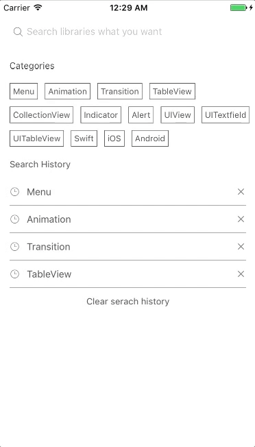
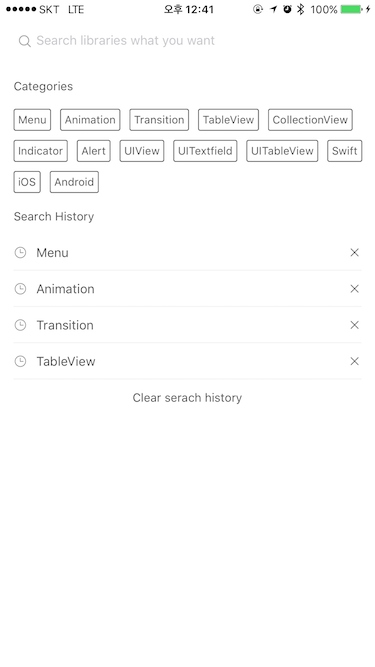

# YNSearch + Realm Support

[](https://github.com/sindresorhus/awesome)
[](http://cocoapods.org/pods/YNSearch)
[](https://github.com/Carthage/Carthage)
[](https://github.com/younatics/YNSearch/blob/master/LICENSE)
[](https://travis-ci.org/younatics/YNSearch)
[](http://cocoapods.org/pods/YNSearch)
[](https://developer.apple.com/swift/)

#### ✨[Listed 2nd on trending open source and 6th on trending developer in Github Swift category [04/18/2017]](https://github.com/younatics/YNDropDownMenu/blob/master/Images/2nd.PNG)
#### ✨[NatashaTheRobot shared YNSearch in 'This Week in Swift'](https://swiftnews.curated.co/issues/128#start)
## Updates
See [CHANGELOG](https://github.com/younatics/YNSearch/blob/master/CHANGELOG.md) for details

## Intoduction
🔍 Awesome search view, written in Swift 3, appears search view like Pinterest Search view. You can fully customize this library. You can also use this library with Realm! See usage in below





## Requirements

`YNSearch` is written in Swift 3. Compatible with iOS 8.0+

## Installation

### Cocoapods

YNSearch is available through [CocoaPods](http://cocoapods.org). To install
it, simply add the following line to your Podfile:

```ruby
pod 'YNSearch'
```
### Carthage
```
github "younatics/YNSearch"
```

## Simple Usage
Set categories (required) and search histories (optional)
```swift
import YNSearch

let demoDatabase = ["Menu", "Animation", "Transition", "TableView", "CollectionView", "Indicator", "Alert", "UIView", "UITextfield", "UITableView", "Swift", "iOS", "Android"]

ynSearch.setCategories(value: demoDatabase)
ynSearch.setSearchHistories(value: demoDatabase)

self.ynSearchinit()
```

Set database (required) and key (required). key will be displayed in `YNSearchListView` You can set your database `[Any]` if you want to customize. 
```swift
let database1 = YNDropDownMenu(key: "YNDropDownMenu")
let database2 = YNSearchData(key: "YNSearchData")
let demoDatabase = [database1, database2]
        
self.initData(database: demoDatabase)
```

Set `YNSearchListView` Delegate
```Swift
func ynSearchListView(_ ynSearchListView: UITableView, cellForRowAt indexPath: IndexPath) -> UITableViewCell {
        let cell = self.ynSearchView.ynSearchListView.dequeueReusableCell(withIdentifier: YNSearchListViewCell.ID) as! YNSearchListViewCell
        if let ynmodel = self.ynSearchView.ynSearchListView.searchResultDatabase[indexPath.row] as? YNSearchModel {
            cell.searchLabel.text = ynmodel.key
        }
        
        return cell
}
    
func ynSearchListView(_ ynSearchListView: UITableView, didSelectRowAt indexPath: IndexPath) {
        if let ynmodel = self.ynSearchView.ynSearchListView.searchResultDatabase[indexPath.row] as? YNSearchModel, let key = ynmodel.key {
        // Call listview clicked based on key
        self.ynSearchView.ynSearchListView.ynSearchListViewDelegate?.ynSearchListViewClicked(key: key)
        
        // return object you set in database
        self.ynSearchView.ynSearchListView.ynSearchListViewDelegate?.ynSearchListViewClicked(object: self.ynSearchView.ynSearchListView.database[indexPath.row])
        
        // Append Search history
        self.ynSearchView.ynSearchListView.ynSearch.appendSearchHistories(value: key)
        }
}
```

## Realm Usage
Get your Data with Realm
```Swift 
let datas = realm.objects(RealmModel.self)
```
Realm is not collection type so you need to convert it again with `[Any]`type. This will find all string in your RealmModel and show you results.
```Swift 
var dataArray = [Any]()
for data in datas {
        let searchModel = RealmModel()
            searchModel.author = data.author
            searchModel.detail = data.detail
            searchModel.title = data.title
            searchModel.type = data.type
            
            dataArray.append(searchModel)
        }
        
self.initData(database: dataArray)
```


#### I used [Objectification](https://github.com/younatics/Objectification) for accurate search result. This library will get all data in your object and search if for us.
Done!

## View Hierachy
```
YNSearchViewController: Inherit this viewcontroller 
|-- YNSearchTextFieldView: YNSearchTextField with cancel button
|   |-- YNSearchTextField: Search UITextfield
|   |-- cancelButton: Show when YNSearchTextField textFieldDidBeginEditing
|
|-- YNSearchView : get both YNSearchMainView and YNSearchListView
|   |-- YNSearchMainView: First view that you can see
|   |   |-- categoryLabel: Cateogry label
|   |   |-- [YNCategoryButton]: cateogory buttons
|   |   |-- searchHistoryLabel: Search history label
|   |   |-- [YNSearchHistoryView]: history views
|   |   |   |-- [YNSearchHistoryButton]: Search history button
|   |   |   |-- [closeButton]: Close button
|   |
|   |-- YNSearchListView: UITableview with search result
```

## Custom Usage
set `YNSearchDelegate` if you want callback
```Swift 
self.delegate = self

func ynSearchHistoryButtonClicked(text: String) {
  print(text)
}
    
func ynCategoryButtonClicked(text: String) {
  print(text)
}
    
func ynSearchListViewClicked(text: String) {
  print(text)
}

func ynSearchListViewClicked(object: YNSearchModel) {
  print(object)
}
```

Set `YNCategoryButton` type.
```Swift
self.ynSearchView.ynSearchMainView.setYNCategoryButtonType(type: .colorful)
```

See more usage in demo

#### You can fully customize this `YNSearch` based on view hierachy

## References
#### Please tell me or make pull request if you use this library in your application :) 

## Author
[younatics 🇰🇷](http://younatics.github.io)

## License
YNSearch is available under the MIT license. See the LICENSE file for more info.
